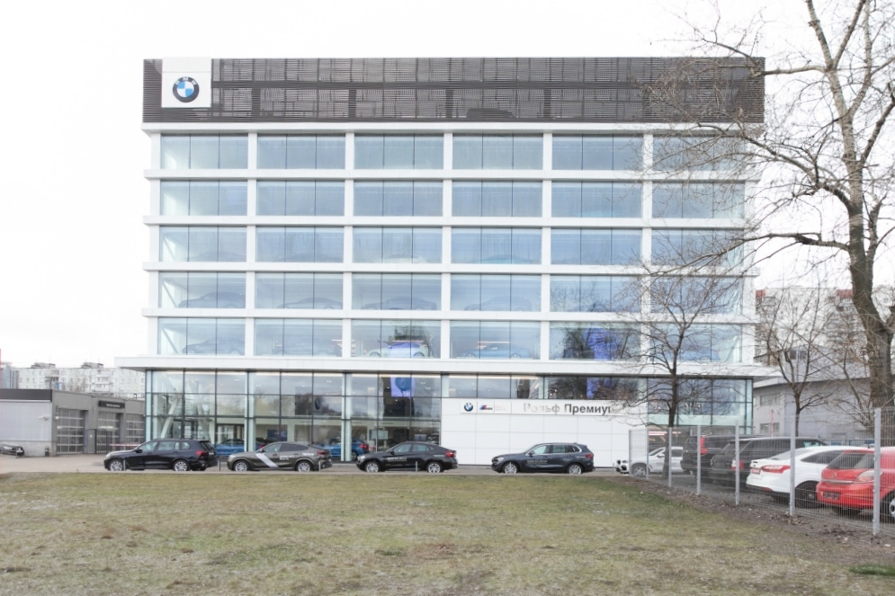
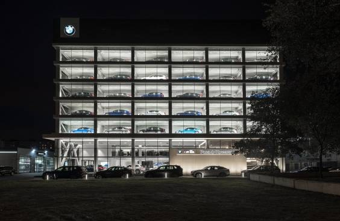

<h2>Fix of incorrectly installed backlight</h2>

<h4>Сhallenge</h4>

Due to the incorrect installation of some controllers of the backlight system, the vendor's software is constantly confused when counting sunrises and sunsets. But the web interface with control buttons works correctly...
 
<h4>Solution</h4>

- Selenium
- Python

 
<h4>Result</h4>

<i>photos of the building from the Internet</i>

